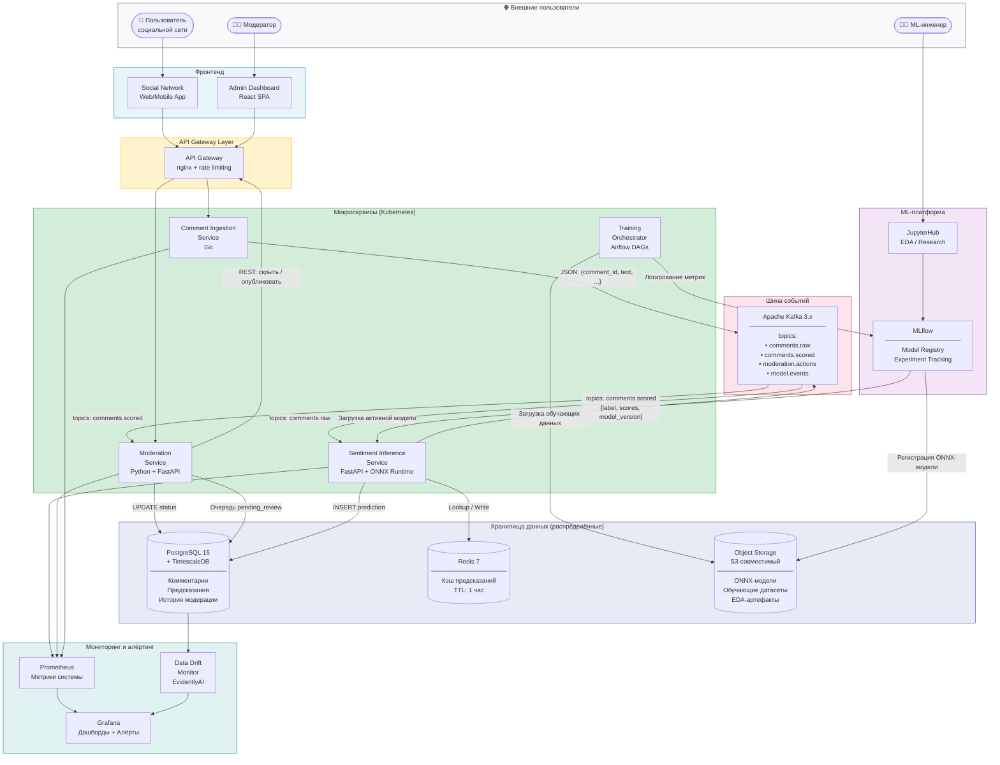
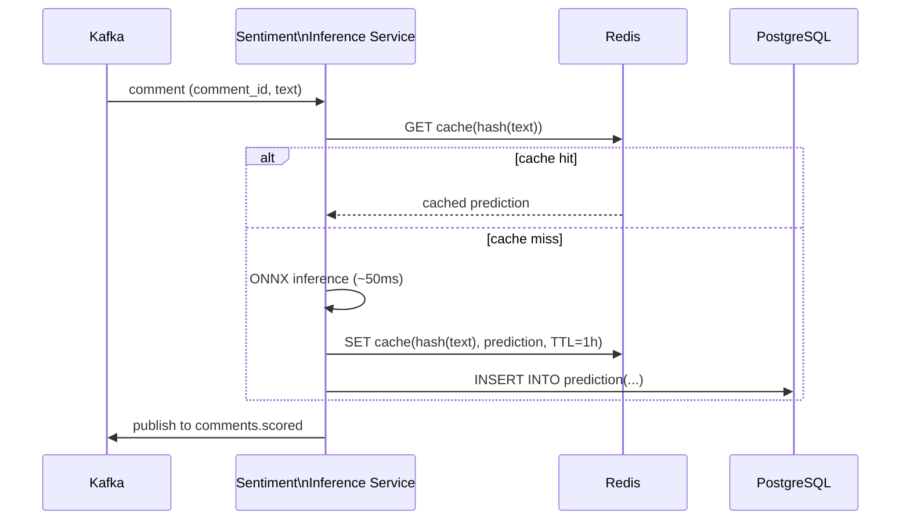

# Диаграмма архитектуры системы

> Архитектура распределённой ML-системы анализа тональности комментариев.  
> Показано: как данные проходят путь от публикации комментария до вынесения решения по модерации.

## Общая схема (C4 Level 2 — Container Diagram)

## Почему данные хранятся распределённо

| Хранилище | Тип данных | Причина распределения |
|---|---|---|
| **Kafka** | Горячие события (TTL 24 ч) | Буферизация пиков нагрузки; декаплинг producer/consumer; replay при сбоях |
| **Redis** | Кэш предсказаний (TTL 1 ч) | Дедупликация одинаковых текстов (спам); снижение latency при повторах |
| **PostgreSQL** | Структурированные данные | Долгосрочное хранение; сложные SQL-запросы; аудит для регулятора |
| **Object Storage (S3)** | Артефакты моделей, датасеты | Дешёвое хранение больших бинарных файлов; версионирование моделей |

> Распределённый характер хранения обусловлен разными требованиями к **скорости доступа**, **объёму**, **стоимости** и **retention policy** у разных типов данных.

## Потоки данных

