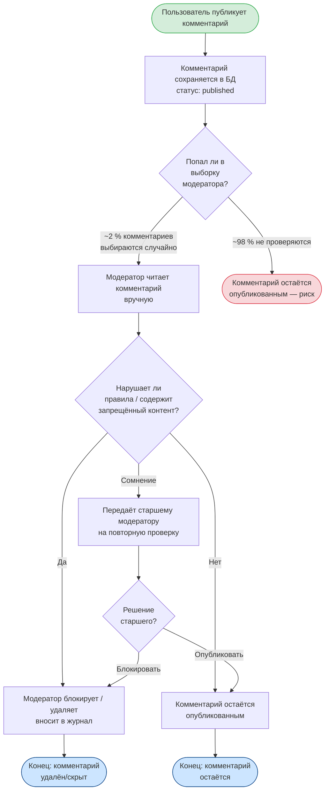

# BPMN AS-IS — Текущий процесс модерации комментариев

> Бизнес-процесс **до** внедрения ML-системы.  
> Акцент: ручной, медленный, охватывает < 2 % потока, субъективный результат.

## Проблемы текущего процесса (AS-IS)

| Проблема | Последствие |
|---|---|
| Охват < 2 % потока | 98 % токсичных комментариев не обнаруживается вовремя |
| Время реакции — часы | Штрафы РКН, распространение вредоносного контента |
| Субъективность оценки | Неконсистентные решения разных модераторов |
| Высокие ФОТ-расходы | При 500 000 комментариев/сутки требуется ≥ 20 модераторов |
| Нет аналитики тональности | Невозможно улучшить редакционную политику |
