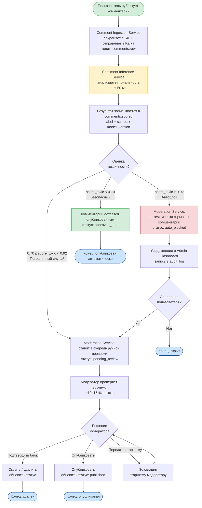

# BPMN TO-BE — Целевой процесс модерации с ML-системой

> Бизнес-процесс **после** внедрения ML-системы анализа тональности.  
> Акцент: 100 % охват, автоматическое решение по явным случаям, ручная проверка только пограничных (~10–15 %).

## Что изменяет ML-система (сравнение AS-IS vs. TO-BE)

| Параметр | AS-IS (без ML) | TO-BE (с ML) | Изменение |
|---|---|---|---|
| Охват проверки | ~2 % | 100 % | **×50** |
| Время реакции | Часы | ≤ 30 сек | **×360** |
| Нагрузка на модераторов | 100 % потока (выборочно) | 10–15 % потока (пограничные) | **−85 %** |
| Консистентность решений | Субъективная | Детерминированная (порог) | **+** |
| Аналитика тональности | Нет | Дашборд в реальном времени | **Новая возможность** |
| Риск штрафов РКН | Высокий | Низкий (recall ≥ 0.95) | **−** |
| Операционные расходы | ≥ 20 модераторов | 5–7 модераторов | **−65 % ФОТ** |
