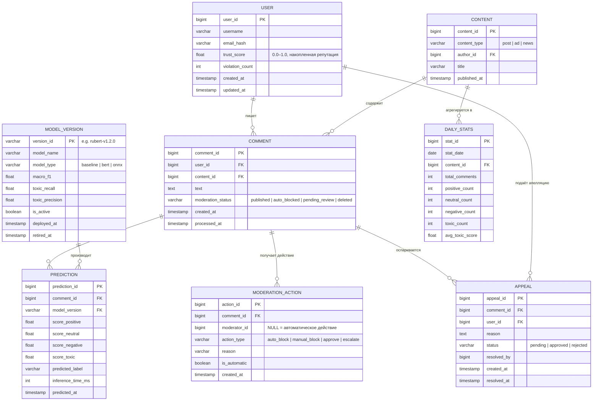

# ER-диаграмма структуры данных

> База данных: **PostgreSQL 15 + TimescaleDB** (для time-series данных предсказаний).  
> Хранит: комментарии, пользователей, результаты инференса, историю модерации, версии моделей.



## Описание ключевых сущностей

### `COMMENT` — центральная сущность
Хранит текст и текущий статус каждого комментария. Поле `moderation_status` обновляется в ходе обработки.

### `PREDICTION` — результаты инференса
Каждый комментарий имеет ровно одно актуальное предсказание (при переинференсе создаётся новая запись). Хранение всех предсказаний с `model_version` обеспечивает аудит для регулятора.

### `MODEL_VERSION` — реестр моделей
Связан с MLflow Model Registry. Только одна версия имеет `is_active = true`. Откат — изменение флага без удаления истории.

### `DAILY_STATS` — агрегат для дашборда
Партиционируется по `stat_date` (TimescaleDB hypertable) для быстрой выборки аналитики без нагрузки на оперативные таблицы.

## Индексы

```sql
-- Быстрый поиск по статусу (очередь модерации)
CREATE INDEX idx_comment_status ON comment(moderation_status, created_at DESC);

-- Предсказания по времени (TimescaleDB)
SELECT create_hypertable('prediction', 'predicted_at');

-- Поиск предсказаний к конкретному комментарию
CREATE INDEX idx_prediction_comment ON prediction(comment_id);

-- Аналитика по контенту
CREATE INDEX idx_daily_stats_date ON daily_stats(stat_date DESC, content_id);
```
