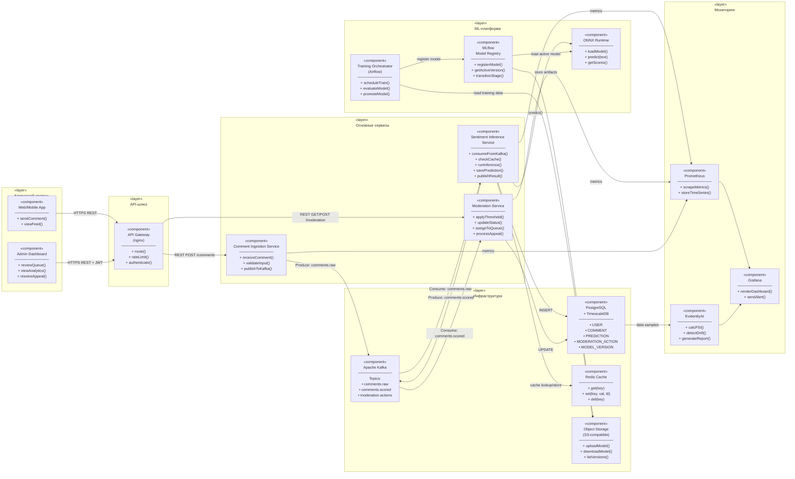

# UML-диаграмма компонентов

> Структурная диаграмма компонентов системы анализа тональности комментариев.  
> Показаны компоненты, их интерфейсы и зависимости.

## Описание интерфейсов

### Comment Ingestion Service
| Интерфейс | Тип | Описание |
|---|---|---|
| `POST /api/v1/comments` | REST (входящий) | Приём нового комментария от фронтенда |
| Kafka Producer | Message Bus (исходящий) | Публикация в `comments.raw` |

### Sentiment Inference Service
| Интерфейс | Тип | Описание |
|---|---|---|
| Kafka Consumer Group | Message Bus (входящий) | Подписка на `comments.raw` |
| `predict(text) → scores` | Internal | Вызов ONNX Runtime |
| `GET/SET cache` | Redis | Кэш по хэшу текста |
| `POST /predictions` | PostgreSQL | Запись результата |
| Kafka Producer | Message Bus (исходящий) | Публикация в `comments.scored` |

### Moderation Service
| Интерфейс | Тип | Описание |
|---|---|---|
| Kafka Consumer Group | Message Bus (входящий) | Подписка на `comments.scored` |
| `POST /comments/{id}/hide` | REST (исходящий) | Скрытие комментария в соцсети |
| `GET /queue` | REST (входящий от Dashboard) | Получение очереди на проверку |
| `POST /actions` | REST (входящий от Dashboard) | Действие модератора |
