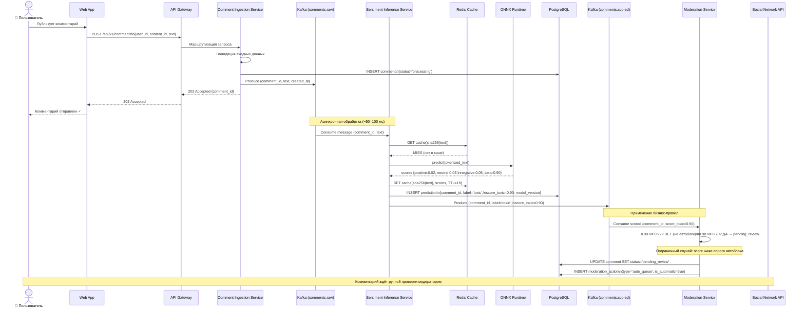
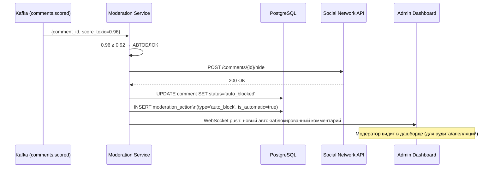
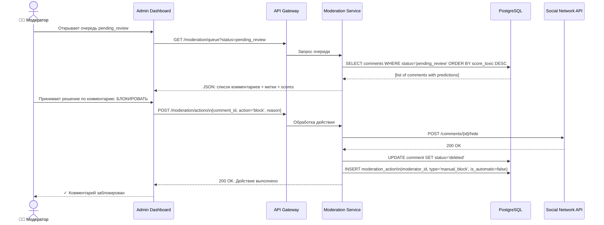
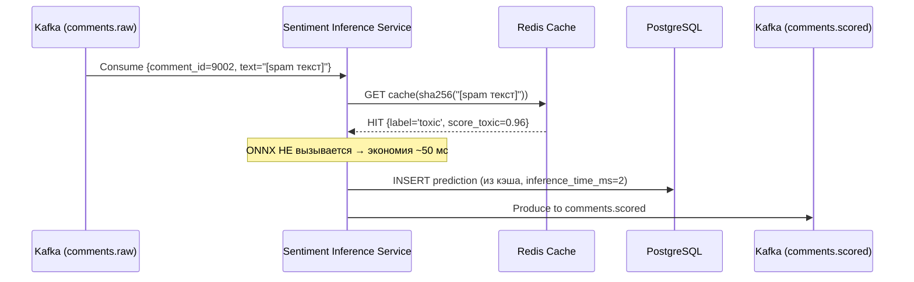

# UML-диаграмма последовательности

> Поведенческая диаграмма: полный путь комментария от публикации до вынесения решения по модерации.

## Сценарий 1 — Пограничный случай: комментарий помещается в очередь (score=0.90)

## Сценарий 2 — Явно токсичный (score ≥ 0.92), автоблок

## Сценарий 3 — Ручная проверка модератором

## Сценарий 4 — Кэш-хит (повторный одинаковый текст)

