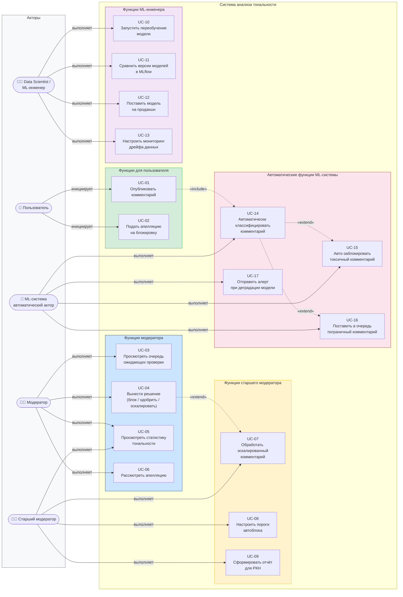

# UML-диаграмма прецедентов (Use Case)

> Поведенческая диаграмма: акторы системы и их взаимодействие с функциональностью.

## Таблица прецедентов

| ID | Название | Актор | Приоритет MVP |
|---|---|---|---|
| UC-01 | Опубликовать комментарий | Пользователь | Обязательно |
| UC-02 | Подать апелляцию | Пользователь | Желательно |
| UC-03 | Просмотреть очередь | Модератор | Обязательно |
| UC-04 | Вынести решение | Модератор | Обязательно |
| UC-05 | Статистика тональности | Модератор / Старший | Желательно |
| UC-06 | Рассмотреть апелляцию | Модератор | Желательно |
| UC-07 | Обработать эскалацию | Старший модератор | Обязательно |
| UC-08 | Настроить пороги | Старший модератор | Обязательно |
| UC-09 | Отчёт для РКН | Старший модератор | Желательно |
| UC-10 | Переобучение модели | ML-инженер | Технический долг |
| UC-11 | Сравнение версий | ML-инженер | Обязательно |
| UC-12 | Деплой модели | ML-инженер | Обязательно |
| UC-13 | Мониторинг дрейфа | ML-инженер | Желательно |
| UC-14 | Классификация комментария | ML-система | Обязательно |
| UC-15 | Авто-блок | ML-система | Обязательно |
| UC-16 | В очередь (пограничный) | ML-система | Обязательно |
| UC-17 | Алерт при деградации | ML-система | Желательно |
